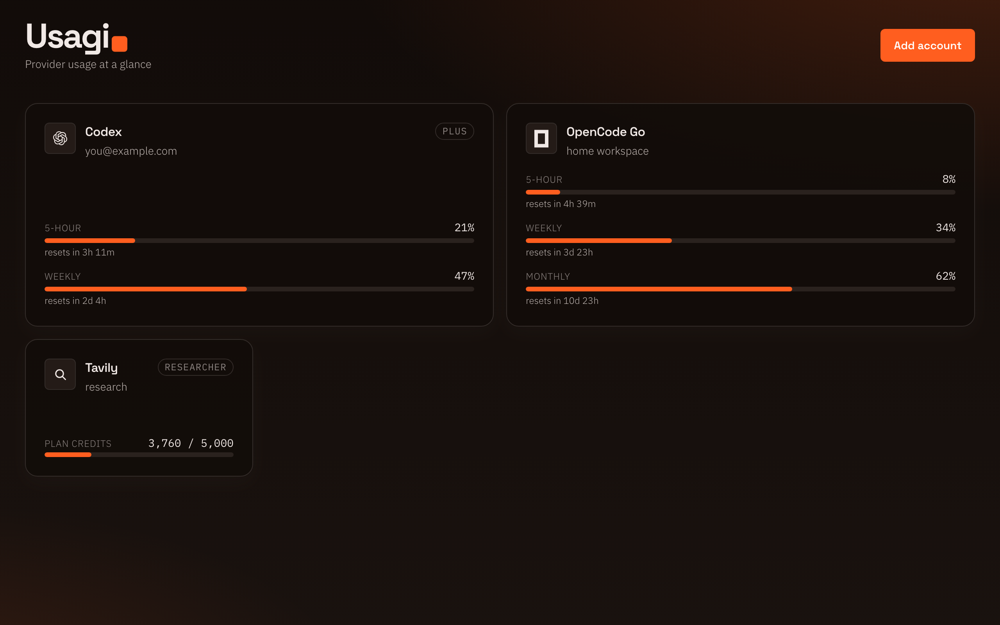

# Usagi

Self-hosted usage board for provider accounts.



## Run

```bash
bun install
bun run dev
```

Or with Docker:

```bash
docker run --rm -p 3000:3000 -v usagi-data:/app/data ghcr.io/bgwastu/usagi:latest
```

Open [http://localhost:3000](http://localhost:3000). Accounts live in `data/data.json` (gitignored).

Optional: set `ENCRYPTION_KEY` to encrypt that file at rest. If decryption fails, the app exits.

## Providers

- **Codex** — OAuth (PKCE), auto-refresh · 5-hour + weekly windows
- **OpenCode Go** — session cookie; workspace ID optional · 5-hour + weekly (+ monthly if present)
- **Tavily** — API key · plan / key credits
- **Exa** — Team Management service key · 3d / 7d / 30d spend (optional key ID)

## Notes

- Runs without login — keep it on localhost or a trusted network.
- UI polls every 5s; Tavily live-fetches at most every 2 minutes (10 req / 10 min on `/usage`).
- Light/dark follows system preference.
