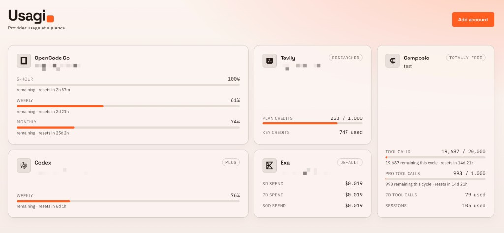

# Usagi

Self-hosted usage board for provider accounts.



## Run

```bash
bun install
bun run dev
```

The development server is Vite. The production self-hosted server is Hono on Bun/Node.

Or with Docker:

```bash
docker run --rm -p 3000:3000 -v usagi-data:/app/data ghcr.io/bgwastu/usagi:latest
```

Open [http://localhost:3000](http://localhost:3000). Accounts live in `data/usagi.sqlite` (gitignored).

Optional environment variables:

- `USAGI_PASSWORD` protects the board and API with a shared password.
- `ENCRYPTION_KEY` encrypts provider credentials at rest in SQLite.

The first self-hosted start creates `data/usagi.sqlite` and imports accounts from the legacy `data/data.json` if present.

## Providers

- **Codex** — OAuth (PKCE), auto-refresh · 5-hour + weekly windows
- **Antigravity** — Google OAuth (desktop client, no PKCE), auto-refresh · Gemini / Claude & Other bars (tap a bar to expand models on the tile)
- **OpenCode Go** — session cookie; workspace ID optional · 5-hour + weekly (+ monthly if present)
- **Cursor** — `WorkosCursorSessionToken` cookie · plan / Auto+Composer / API / on-demand (unofficial dashboard API)
- **Tavily** — API key · plan / key credits
- **Exa** — Team Management service key · spend windows (fast 30d first, then 3d/7d); key budget bar when `budgetCents` is set (optional key ID)
- **Composio** — Org API key (`oak_…`) · monthly tool-call / pro-tool quota bars

## Notes

- Runs without login unless `USAGI_PASSWORD` is configured — keep an unprotected instance on localhost or a trusted network.
- Board shell (accounts + last-known meters) loads instantly; live usage refreshes in the background via `/api/accounts/usage`.
- UI polls usage every 5s; Tavily live-fetches at most every 2 minutes (10 req / 10 min on `/usage`).
- Usage snapshots persist in SQLite so cold restarts still show stale meters.
- Light/dark follows system preference.
