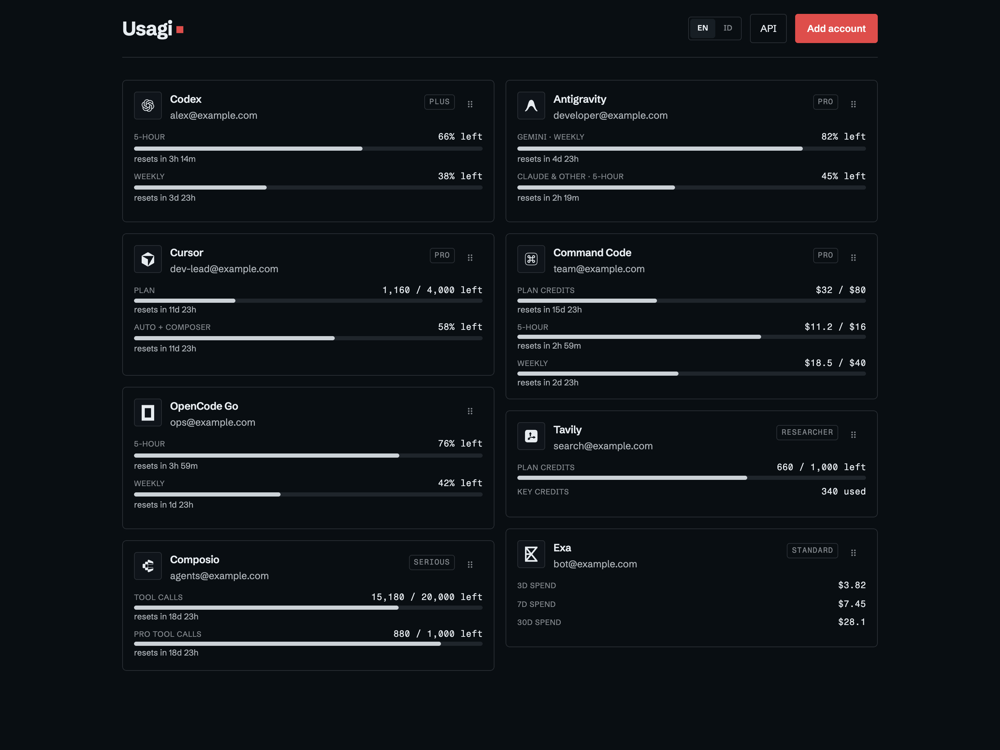

# Usagi

Self-hosted usage board for provider accounts.

<picture>
  <source media="(prefers-color-scheme: dark)" srcset="docs/screenshots/board-dark.png">
  <source media="(prefers-color-scheme: light)" srcset="docs/screenshots/board-light.png">
  
</picture>

## Run

```bash
bun install
bun run dev
```

The development server is Vite. The production self-hosted server is Hono on Bun/Node.

Or with Docker:

```bash
docker run --rm -p 3000:3000 -v usagi-data:/app/data ghcr.io/bgwastu/usagi:latest
```

Open [http://localhost:5173](http://localhost:5173) in development, or [http://localhost:3000](http://localhost:3000) for the production server. Accounts live in `data/usagi.sqlite` (gitignored).

Optional environment variables:

- `USAGI_PASSWORD` protects the board and JSON API with a shared password.
- `ENCRYPTION_KEY` encrypts provider credentials at rest in SQLite.

The first self-hosted start creates `data/usagi.sqlite` and imports accounts from the legacy `data/data.json` if present.

## JSON API

`GET /api` returns the live board as JSON (same account/usage objects as the UI, credentials stripped). `?force=1` bypasses provider refresh windows where allowed.

```bash
curl http://localhost:3000/api
```

If `USAGI_PASSWORD` is set, send it as a Bearer token (or `X-Usagi-Password`):

```bash
curl -H "Authorization: Bearer $USAGI_PASSWORD" http://localhost:3000/api
```

The board UI still logs in with a cookie. Browser session cookies and the Bearer password both satisfy the same gate. Auth routes (`/api/auth/*`) stay public so the login form can run.

## Providers

- **Codex** — OAuth (PKCE), auto-refresh · 5-hour + weekly windows
- **Antigravity** — Google OAuth (desktop client, no PKCE), auto-refresh · Gemini / Claude & Other bars (tap a bar to expand models on the tile)
- **OpenCode Go** — session cookie; workspace ID optional · 5-hour + weekly (+ monthly if present)
- **Cursor** — `WorkosCursorSessionToken` cookie · plan / Auto+Composer / API / on-demand (unofficial dashboard API)
- **Tavily** — API key · plan / key credits
- **Exa** — Team Management service key · spend windows (fast 30d first, then 3d/7d); key budget bar when `budgetCents` is set (optional key ID)
- **Composio** — Org API key (`oak_…`) · monthly tool-call / pro-tool quota bars
- **Command Code** — Studio API key (`user_…`) · plan credits + 5-hour / weekly windows

## Notes

- Runs without login unless `USAGI_PASSWORD` is configured — keep an unprotected instance on localhost or a trusted network.
- Light/dark follows system preference.
